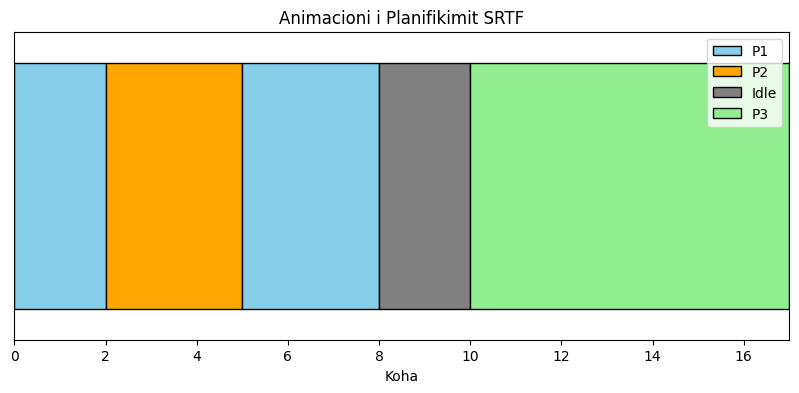

# **Shortest Remaining Time First (SRTF) Scheduling Visualization**

This repository demonstrates the **Shortest Remaining Time First (SRTF)** CPU scheduling algorithm. It includes a **C implementation** to calculate process schedules based on arrival and burst times, and a **Python visualization** (using Matplotlib) to create an animated Gantt chart that shows the execution of processes over time.

## **Features**

Includes a **C program** to simulate SRTF scheduling and calculate key metrics for each process (completion time, waiting time, and turnaround time) and a **Python animation** that dynamically visualizes the execution of processes using the output from the C program.

## **Files in the Repository**

**`srtf.c`**: The main implementation of the SRTF algorithm in C where users can input process data (arrival and burst times) to calculate the schedule.  
**`srtf_visualization.ipynb`**: A Jupyter Notebook that uses Matplotlib to create an animated Gantt chart of the scheduling process, hardcoded for demonstration but adaptable to parse outputs from the C program.  
**`animacioni_srtf.gif`**: The output GIF animation of the scheduling visualization, generated from the Python script.

## **Getting Started**

To run the C program, compile `srtf.c` with `gcc -o srtf srtf.c` and run the executable with `./srtf`, then input the number of processes and their arrival and burst times when prompted.  
For the Python visualization, ensure Python and Matplotlib are installed (`pip install matplotlib`), open the `srtf_visualization.ipynb` file in Jupyter Notebook, run the notebook to generate the Gantt chart animation, and the animation will be saved as `animacioni_srtf.gif`.

**Visualization Output**: The Gantt chart animation shows process execution over time, including active processes (colored for P1, P2, P3) and idle time (gray).

## **How It Works**

The algorithm selects at each unit of time the process with the shortest remaining execution time, prioritizing processes with the same remaining time based on arrival. If no processes are ready, the CPU remains idle. The Gantt chart represents active processes and idle time visually.
